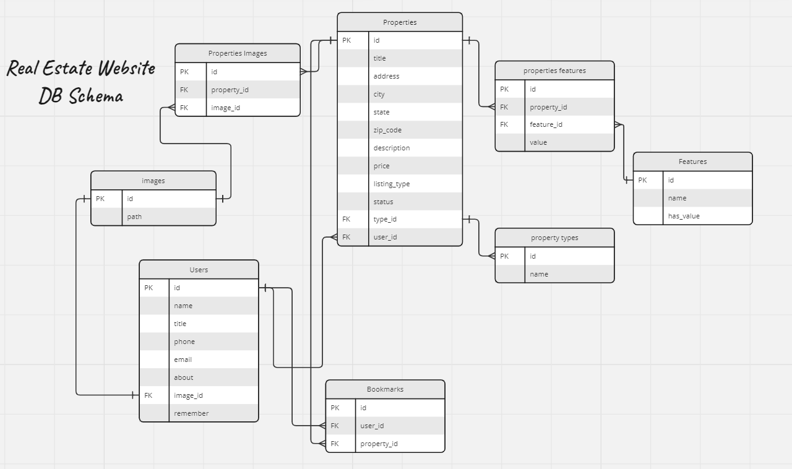

# Real Estate Website - Laravel Project


This project is a real estate website built using the Laravel framework. It allows users to search for properties, submit properties, view property details, contact real estate agents, and manage their accounts.

## Features

- **Property CRUD**: Users can submit, edit, delete, hide and show their properties.
- **Property Search**: Users can search for properties based on various criteria such as location, price range, number of bedrooms, etc.
- **Property Listings**: Detailed listings of properties including images, descriptions, amenities, and contact information for the agent.
- **User Authentication**: Users can create accounts, log in, and manage their profiles.

## Installation

1. Clone the repository:

   ```bash
   git clone https://github.com/Miqayel87/real_estate.git
   ```

2. Navigate to the project directory:

   ```bash
   cd real-estate
   ```

3. Install dependencies:

   ```bash
   composer install
   ```

4. Copy the `.env.example` file to `.env` and configure your environment variables such as database connection settings.

5. Generate an application key:

   ```bash
   php artisan key:generate
   ```

6. Run migrations to create the necessary database tables:

   ```bash
   php artisan migrate
   ```

7. Optionally, seed the database with sample data:

   ```bash
   php artisan db:seed
   ```

8. Start the development server:

   ```bash
   php artisan serve
   ```

   The website should now be accessible at `http://127.0.0.1:8000`.

## DataBase

   
